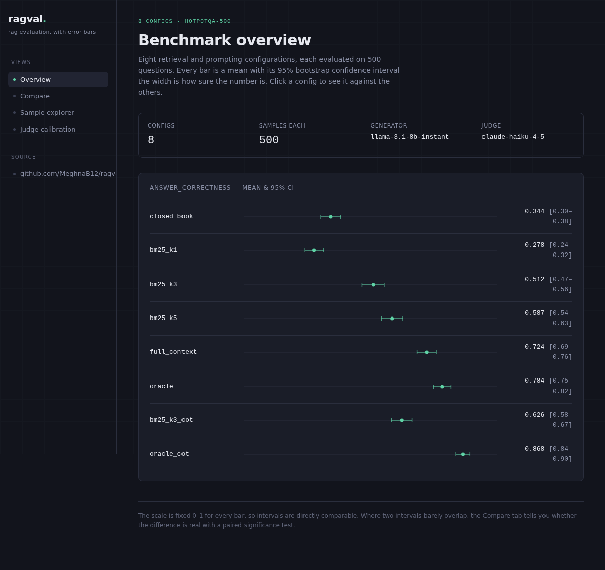
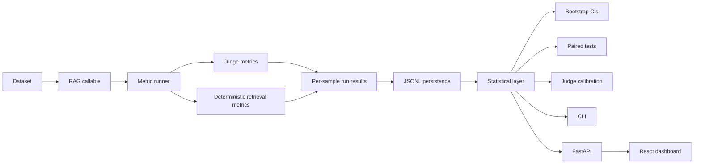
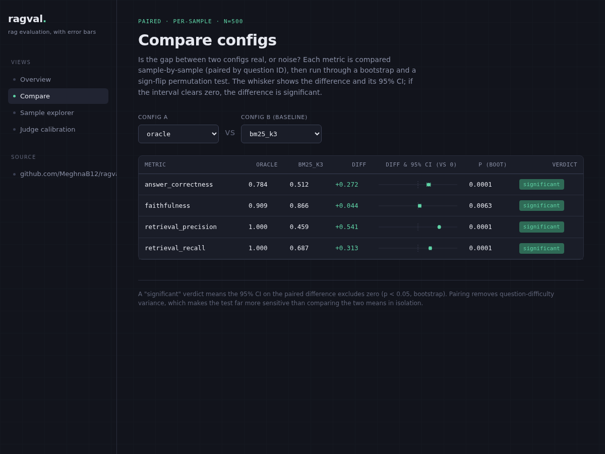
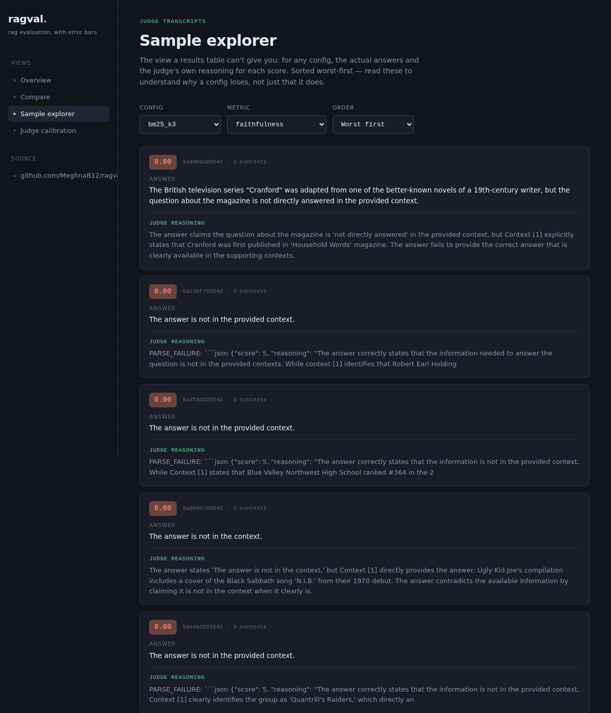
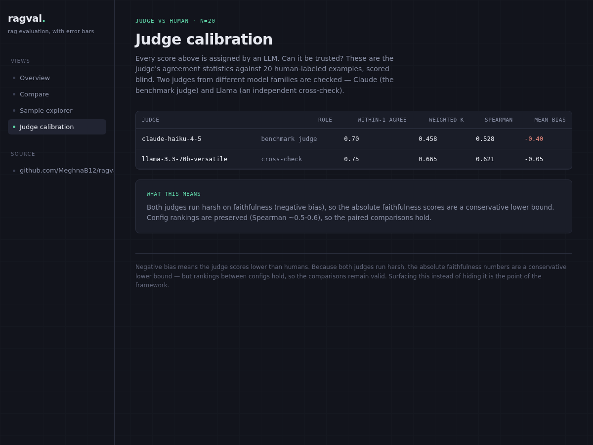

# ragval

[](https://github.com/MeghnaB12/ragval/actions/workflows/ci.yml)


> **Statistically rigorous RAG evaluation:** confidence intervals, paired significance tests, judge calibration, reproducible runs, and a full-stack dashboard.

**[Live dashboard](https://ragval.vercel.app)** · **[Architecture](docs/ARCHITECTURE.md)** · **[Dashboard docs](dashboard/README.md)**



## What ragval solves

Most RAG evaluations stop at aggregate scores:

```text
config A = 0.74
config B = 0.71
```

That does not answer the important question: **is A actually better, or is the gap just sampling noise?**

ragval treats RAG evaluation as an experiment rather than a leaderboard. It combines per-sample persistence, bootstrap confidence intervals, paired significance tests, and LLM-judge calibration so configuration changes can be compared with uncertainty made explicit.

### Why it is different

- **Statistical rigor** — every metric can report a 95% bootstrap confidence interval; configuration comparisons use paired bootstrap and sign-flip permutation tests aligned by sample ID.
- **Judge calibration** — compare an LLM judge against human labels using agreement, weighted kappa, Spearman correlation, and mean bias before trusting its absolute scores.
- **Reproducibility** — seeded statistics, disk-cached judge calls, persisted JSONL runs, and resumable benchmarks make results repeatable.
- **Framework-agnostic** — evaluate LangChain, LlamaIndex, custom RAG pipelines, or ordinary Python callables.
- **Full-stack inspection** — a FastAPI + React dashboard exposes the same statistical engine for interactive comparison, sample inspection, and calibration analysis.

## Architecture



See [`docs/ARCHITECTURE.md`](docs/ARCHITECTURE.md) for the design and data-flow details.

## Dashboard

The web dashboard visualizes benchmark runs, confidence intervals, paired comparisons, per-sample judge reasoning, and judge calibration.

| Compare configurations | Inspect samples | Judge calibration |
| --- | --- | --- |
|  |  |  |

Local development:

```bash
cd dashboard
./dev.sh
# FastAPI: http://localhost:8000
# React:   http://localhost:5173
```

## Quick start

### Install for development

```bash
git clone https://github.com/MeghnaB12/ragval
cd ragval
pip install -e ".[dev,dashboard,reference]"
cp .env.example .env
```

Configure only the provider keys you use. For example:

```env
GROQ_API_KEY=gsk_...
ANTHROPIC_API_KEY=sk-ant-...
```

### Evaluate any RAG callable

```python
from ragval import EvalSample, RagOutput
from ragval.judges import GroqJudge
from ragval.metrics import Faithfulness, AnswerRelevance, AnswerCorrectness
from ragval.runner import run_eval
from ragval.runs import save_run
from ragval.stats import summarize_run


def my_rag(question: str) -> RagOutput:
    # LangChain, LlamaIndex, custom pipeline, or plain Python
    ...


dataset = [
    EvalSample(
        id="1",
        question="...",
        ground_truth_answer="...",
    )
]

result = run_eval(
    my_rag,
    dataset,
    [Faithfulness(), AnswerRelevance(), AnswerCorrectness()],
    GroqJudge(),
)

save_run(result)

for summary in summarize_run(result):
    print(summary)
```

Example output:

```text
faithfulness: 0.866 [95% CI 0.84-0.89] (n=500)
```

## Compare configurations statistically

```python
from ragval.runs import load_run
from ragval.stats import compare_runs

baseline = load_run("benchmarks/results/bm25_k3-hotpotqa500.jsonl")
variant = load_run("benchmarks/results/oracle-hotpotqa500.jsonl")

print(compare_runs(variant, baseline, "answer_correctness"))
```

Example:

```text
answer_correctness: oracle=0.784 vs bm25_k3=0.512 | diff=+0.272
95% CI [+0.227, +0.317] | p_boot=0.0001 | p_perm=0.0001 | SIGNIFICANT
```

Comparisons are paired by sample ID, which controls for question-level difficulty instead of treating two runs as unrelated samples.

## CLI

```bash
ragval runs
ragval report bm25_k3
ragval compare oracle bm25_k3
ragval calibrate cal.jsonl --metric faithfulness --judge groq
```

## What is implemented

- [x] Core evaluation data types
- [x] Claude, Gemini, Groq, and mock judge abstraction
- [x] Judge-call disk caching, rate limiting, and retry
- [x] Faithfulness, answer relevance, and answer correctness
- [x] Judge-based context precision and recall
- [x] Deterministic retrieval precision and recall
- [x] Bootstrap confidence intervals
- [x] Paired bootstrap and permutation tests
- [x] Judge calibration against human labels
- [x] JSONL run persistence
- [x] CLI reporting and comparison
- [x] Streamlit local dashboard
- [x] FastAPI + React dashboard
- [x] HotpotQA-500 benchmark across eight configurations
- [x] Resumable benchmark execution and quota estimation

## HotpotQA-500 benchmark

The published benchmark evaluates **8 RAG configurations on the same 500-question HotpotQA sample**, varying retrieval quality and prompting strategy.

| Config | Retrieval | Prompt |
| --- | --- | --- |
| `closed_book` | none | concise |
| `bm25_k1` | BM25 top-1 | concise |
| `bm25_k3` | BM25 top-3 | concise |
| `bm25_k5` | BM25 top-5 | concise |
| `full_context` | all 10 paragraphs | concise |
| `oracle` | gold supporting paragraphs | concise |
| `bm25_k3_cot` | BM25 top-3 | chain-of-thought |
| `oracle_cot` | gold supporting paragraphs | chain-of-thought |

Generator: `llama-3.1-8b-instant`  
Judge: `claude-haiku-4-5`  
Sample size: `n=500`

### Results

| Config | Answer correctness | Faithfulness | Retrieval precision | Retrieval recall |
| --- | ---: | ---: | ---: | ---: |
| `closed_book` | 0.344 [0.30-0.38] | 0.262 [0.22-0.30] | 0.000 | 0.000 |
| `bm25_k1` | 0.278 [0.24-0.32] | 0.859 [0.83-0.88] | 0.800 [0.77-0.83] | 0.400 [0.38-0.42] |
| `bm25_k3` | 0.512 [0.47-0.56] | 0.866 [0.84-0.89] | 0.459 [0.44-0.48] | 0.687 [0.66-0.71] |
| `bm25_k5` | 0.587 [0.54-0.63] | 0.878 [0.85-0.90] | 0.318 [0.31-0.33] | 0.791 [0.77-0.81] |
| `full_context` | 0.724 [0.69-0.76] | 0.891 [0.87-0.92] | 0.202 [0.20-0.21] | 1.000 |
| `oracle` | 0.784 [0.75-0.82] | 0.909 [0.89-0.93] | 1.000 | 1.000 |
| `bm25_k3_cot` | 0.626 [0.58-0.67] | 0.714 [0.68-0.75] | 0.459 [0.44-0.48] | 0.687 [0.66-0.71] |
| `oracle_cot` | 0.868 [0.84-0.90] | 0.895 [0.87-0.92] | 1.000 | 1.000 |

### Main findings

- **Retrieval quality strongly tracks answer correctness.** Correctness rises from 0.278 (`bm25_k1`) to 0.512 (`bm25_k3`), 0.587 (`bm25_k5`), and 0.784 (`oracle`) as retrieval recall improves.
- **Poor retrieval can be worse than no retrieval.** `closed_book` scores 0.344 correctness versus 0.278 for `bm25_k1`, showing that a weak retrieved context can actively mislead generation.
- **Perfect retrieval does not guarantee perfect answers.** `oracle` has retrieval precision/recall of 1.0 but answer correctness of 0.784, separating generation limitations from retrieval limitations.
- **Chain-of-thought can trade faithfulness for correctness.** `bm25_k3_cot` improves correctness from 0.512 to 0.626 while faithfulness falls from 0.866 to 0.714.
- **More context is not automatically better.** `full_context` reaches recall 1.0 but only 0.202 precision and still underperforms `oracle` on correctness.

### Paired comparisons against `bm25_k3`

| Config | Metric | Diff | 95% CI | p (boot) | p (perm) | Verdict |
| --- | --- | ---: | --- | ---: | ---: | --- |
| `closed_book` | answer correctness | -0.168 | [-0.220, -0.116] | 0.0001 | 0.0001 | significant |
| `bm25_k1` | answer correctness | -0.234 | [-0.280, -0.189] | 0.0001 | 0.0001 | significant |
| `bm25_k5` | answer correctness | +0.074 | [+0.041, +0.109] | 0.0001 | 0.0001 | significant |
| `full_context` | answer correctness | +0.211 | [+0.166, +0.257] | 0.0001 | 0.0001 | significant |
| `oracle` | answer correctness | +0.272 | [+0.227, +0.317] | 0.0001 | 0.0001 | significant |
| `bm25_k3_cot` | answer correctness | +0.114 | [+0.074, +0.153] | 0.0001 | 0.0001 | significant |
| `bm25_k3_cot` | faithfulness | -0.151 | [-0.194, -0.109] | 0.0001 | 0.0001 | significant |
| `oracle_cot` | answer correctness | +0.355 | [+0.309, +0.400] | 0.0001 | 0.0001 | significant |

Full per-metric comparisons are reproducible locally with:

```bash
ragval compare <config> bm25_k3
```

## Judge calibration

The benchmark faithfulness judge was checked against 20 human-labeled examples scored before seeing judge output.

| Judge | Within-1 agreement | Quadratic-weighted κ | Spearman | Mean bias |
| --- | ---: | ---: | ---: | ---: |
| `claude-haiku-4-5` | 0.70 | 0.458 | 0.528 | -0.40 |
| `llama-3.3-70b` | 0.75 | 0.665 | 0.621 | -0.05 |

The calibration results show why absolute LLM-judge scores should not be treated as ground truth. In this sample, both judges are somewhat harsh on faithfulness, while rank correlation remains moderate. ragval exposes that uncertainty instead of hiding it behind a single score.

## Reproduce the benchmark

```bash
# regenerate the dataset sample
python scripts/prepare_hotpotqa.py

# inspect provider quota
python scripts/check_quota.py

# estimate token usage/cost without making model calls
python scripts/run_benchmark.py --estimate-only

# run; partial progress is checkpointed and resumes automatically
python scripts/run_benchmark.py --judge claude --rpm 24 --yes
```

Completed samples are checkpointed and judge calls are cached, so quota interruptions do not require restarting the full experiment.

## Repository layout

```text
ragval/
├── src/ragval/          # evaluation engine, judges, metrics, stats, CLI
├── tests/               # automated test suite
├── benchmarks/          # HotpotQA dataset, configs, and saved results
├── scripts/             # benchmark preparation and execution
├── dashboard/           # FastAPI + React dashboard
├── docs/                # architecture documentation
├── pyproject.toml       # package metadata and tooling configuration
└── .github/             # CI workflows
```

## Design principles

1. **Compare distributions, not just means.** A benchmark score without uncertainty can be misleading.
2. **Preserve per-sample results.** Paired analysis is only possible when individual examples remain aligned across configurations.
3. **Calibrate judges.** LLM-as-judge is useful, but it is still a measurement instrument with bias.
4. **Keep the evaluated RAG framework-independent.** The evaluation layer should not force an application to adopt a specific orchestration framework.
5. **Make experiments resumable and reproducible.** Evaluation is often constrained by provider quotas, latency, and cost.

## License

MIT
