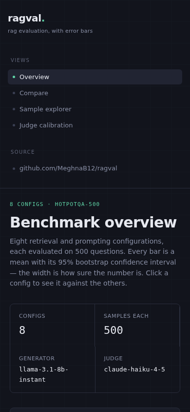

# ragval dashboard

A full-stack web app for exploring the ragval benchmark results — a FastAPI
backend serving the statistical engine, and a React frontend that visualizes
confidence intervals, paired significance tests, judge reasoning, and calibration.

**Live demo:** _(add your deployed URL here after deploying — see below)_


The four views:

| Compare (paired significance) | Sample explorer (judge reasoning) |
|---|---|
|  |  |

| Judge calibration | Mobile |
|---|---|
|  |  |

## Why this exists

The benchmark results live in the repo as JSONL run files and a README table.
That's reproducible but not *explorable* — you can't sort samples by score, read
the judge's reasoning for a given failure, or flip between config comparisons.
This dashboard is the interface the data wanted: it reads the same run files and
calls the same `ragval.stats` functions the CLI uses, so nothing it shows can
disagree with `ragval compare`.

## Architecture

```
 React (Vite)  ──HTTP──▶  FastAPI  ──calls──▶  ragval.stats / ragval.runs
 frontend/                backend/             (the existing engine)
```

- **Backend** (`backend/main.py`) — a thin REST layer. Every endpoint reads
  `benchmarks/results/*.jsonl` and delegates all statistics to the ragval
  library. No numbers are computed in the API itself. Pydantic response models
  give an explicit contract, auto-documented at `/docs`.
- **Frontend** (`frontend/`) — React + Vite, plain CSS design tokens, custom SVG
  for the confidence-interval whiskers (no chart library needed for those). Four
  views: Overview, Compare, Sample explorer, Judge calibration.

## Endpoints

| method | path | returns |
|---|---|---|
| GET | `/api/runs` | the 8 configs with run metadata |
| GET | `/api/runs/{config}` | per-metric mean + 95% bootstrap CI |
| GET | `/api/compare?a=&b=` | paired significance tests between two configs |
| GET | `/api/samples/{config}?metric=&order=` | per-sample scores + judge reasoning |
| GET | `/api/calibration` | judge-vs-human agreement summary |

Interactive API docs at `http://localhost:8000/docs` once the backend is running.

## Run locally

One command from this directory:

```bash
./dev.sh
```

Or manually, in two terminals:

```bash
# terminal 1 — backend
pip install -e ..            # installs ragval
pip install -r backend/requirements.txt
cd backend && uvicorn main:app --reload --port 8000

# terminal 2 — frontend
cd frontend
npm install
npm run dev                  # http://localhost:5173
```

The frontend proxies `/api` to the backend in dev, so no CORS setup is needed.

## Deploy

The frontend is a static bundle; the backend is a small Python service. Both have
free-tier hosts.

**Backend → Render (or Railway / Fly):**
- Root directory: repo root
- Build command: `pip install -e . && pip install -r dashboard/backend/requirements.txt`
- Start command: `cd dashboard/backend && uvicorn main:app --host 0.0.0.0 --port $PORT`
- Note the deployed URL, e.g. `https://ragval-api.onrender.com`

**Frontend → Vercel (or Netlify):**
- Root directory: `dashboard/frontend`
- Build command: `npm run build`
- Output directory: `dist`
- Environment variable: `VITE_API_URL=https://ragval-api.onrender.com`

Then put the Vercel URL in this README's "Live demo" line and in the repo's About.

## Stack

FastAPI · Pydantic · React 18 · Vite · plain-CSS design system · custom SVG charts.
