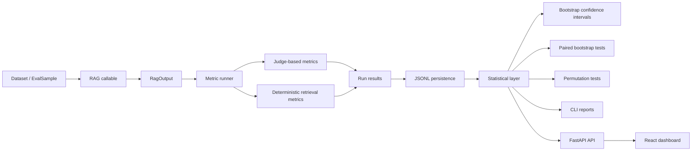
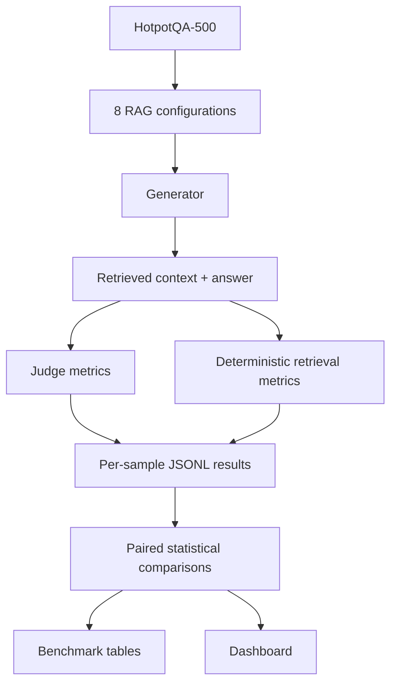
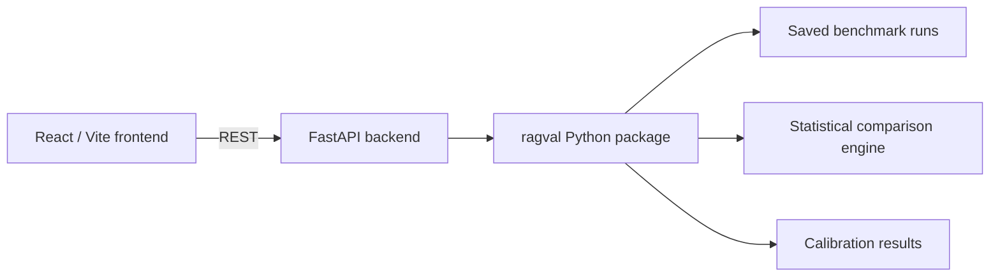

# ragval Architecture

ragval separates evaluation logic, experiment persistence, statistical analysis, and visualization so that the same evaluation engine can be used from Python, the CLI, or the web dashboard.

## System overview



## Core layers

### 1. Evaluation input

A RAG system is represented as a callable:

```python
(question: str) -> RagOutput
```

This keeps ragval framework-agnostic. The evaluated system can be implemented with LangChain, LlamaIndex, a custom pipeline, or ordinary Python functions.

### 2. Metric execution

Metrics are intentionally split into two families:

- **Judge-based metrics** for qualities such as faithfulness, answer relevance, answer correctness, and context quality.
- **Deterministic retrieval metrics** for exact evaluation against known supporting documents.

Judge calls support caching, retries, and rate limiting so repeated analysis does not need to pay for identical evaluations again.

### 3. Run persistence

Evaluation runs are stored as JSONL. Persisting per-sample results is important because statistical comparisons are paired by sample ID instead of comparing only aggregate means.

### 4. Statistical analysis

The statistics layer produces:

- bootstrap confidence intervals for metric means;
- paired bootstrap tests for configuration differences;
- sign-flip permutation tests;
- calibration statistics for LLM judges against human labels.

This is the central design choice of ragval: a result such as `0.74 vs 0.71` is not treated as meaningful until uncertainty is quantified.

### 5. Interfaces

The same evaluation artifacts can be explored through:

- the Python API;
- the `ragval` CLI;
- a lightweight Streamlit view;
- the full FastAPI + React dashboard.

The web dashboard does not reimplement the evaluation logic. It exposes the existing statistical engine through a REST API and visualizes runs, confidence intervals, paired comparisons, samples, and judge calibration.

## Benchmark data flow



## Reliability and reproducibility choices

- **Seeded statistics** make confidence intervals and tests repeatable.
- **Disk-cached judge calls** reduce cost and keep reruns stable.
- **Per-sample persistence** enables paired comparisons after the original run has finished.
- **Resumable benchmarking** checkpoints partial work so provider quotas or interruptions do not force a full restart.
- **Cross-family generation and judging** reduce same-family judge preference in the published benchmark.

## Dashboard architecture



For local dashboard setup and deployment details, see [`dashboard/README.md`](../dashboard/README.md).
